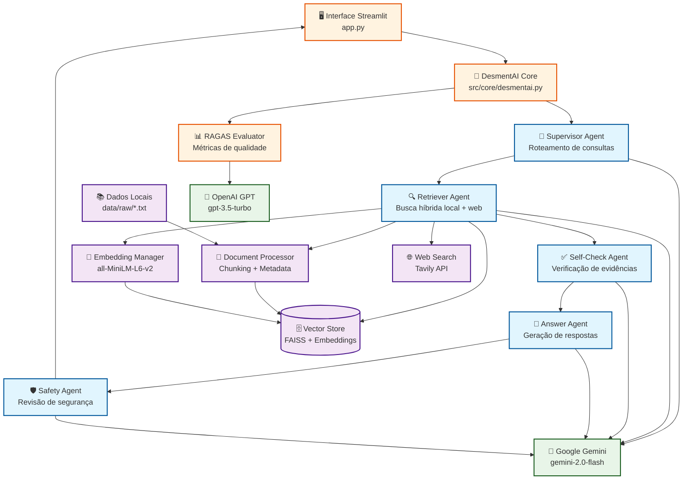

# 🏗️ Arquitetura do Sistema DesmentAI

## Visão Geral

O DesmentAI é um sistema de combate a fake news baseado em **RAG (Retrieval-Augmented Generation)** com arquitetura multi-agente usando **LangGraph** e **Google Gemini**.

## Diagrama da Arquitetura



## Componentes Principais

### 1. 🧠 DesmentAI Core
- **Arquivo**: `src/core/desmentai.py`
- **Função**: Orquestrador principal do sistema
- **Responsabilidades**:
  - Inicialização de componentes
  - Gerenciamento do fluxo de verificação
  - Coordenação entre agentes

### 2. 👑 Supervisor Agent
- **Arquivo**: `src/agents/supervisor.py`
- **Função**: Roteador inteligente de consultas
- **Responsabilidades**:
  - Analisar consultas do usuário
  - Decidir qual agente ativar primeiro
  - Fluxo padrão: RETRIEVER → SELF_CHECK → ANSWER → SAFETY

### 3. 🔍 Retriever Agent
- **Arquivo**: `src/agents/retriever_agent.py`
- **Função**: Busca híbrida de informações
- **Responsabilidades**:
  - Busca local na base de conhecimento (FAISS)
  - Busca web quando necessário (Tavily API)
  - Salvamento de documentos web para futuras consultas
  - Extração de afirmações principais

### 4. ✅ Self-Check Agent
- **Arquivo**: `src/agents/self_check_agent.py`
- **Função**: Verificação de qualidade das evidências
- **Responsabilidades**:
  - Avaliar se há evidências suficientes
  - Classificar qualidade: SUFFICIENT/INSUFFICIENT
  - Determinar confiança na resposta

### 5. 💬 Answer Agent
- **Arquivo**: `src/agents/answer_agent.py`
- **Função**: Geração de respostas baseadas em evidências
- **Responsabilidades**:
  - Gerar respostas estruturadas
  - Filtrar fontes por tipo de busca
  - Extrair citações e evidências
  - Formatar resposta final

### 6. 🛡️ Safety Agent
- **Arquivo**: `src/agents/safety_agent.py`
- **Função**: Revisão de segurança das respostas
- **Responsabilidades**:
  - Verificar conteúdo sensível
  - Aprovar ou modificar respostas
  - Garantir qualidade final

## Fluxo de Dados

### 1. 📥 Entrada
- Usuário insere consulta na interface Streamlit
- Sistema recebe query de verificação

### 2. 🔄 Processamento
1. **Supervisor** analisa a consulta
2. **Retriever** busca informações (local + web se necessário)
3. **Self-Check** avalia qualidade das evidências
4. **Answer** gera resposta baseada em evidências
5. **Safety** revisa e aprova resposta final

### 3. 📤 Saída
- Resposta estruturada com evidências
- Fontes utilizadas (locais ou web)
- Citações e referências
- Nível de confiança

## Tecnologias Utilizadas

### 🤖 Modelos de IA
- **Google Gemini 2.0 Flash**: Modelo principal para agentes
- **OpenAI GPT-3.5-turbo**: Para avaliação RAGAS
- **sentence-transformers/all-MiniLM-L6-v2**: Embeddings

### 🗄️ Armazenamento
- **FAISS**: Vector store para busca semântica
- **Arquivos locais**: Dados brutos em `data/raw/`
- **Pickle**: Serialização de metadados

### 🌐 APIs Externas
- **Tavily API**: Busca web em tempo real
- **Google AI Studio**: API do Gemini
- **OpenAI API**: Para métricas RAGAS

### 📊 Avaliação
- **RAGAS Framework**: Métricas de qualidade
- **10 perguntas de teste**: Dataset de avaliação
- **5 métricas**: Faithfulness, Answer Relevancy, Context Precision, Context Recall, Answer Correctness

## Configuração do Sistema

### Variáveis de Ambiente
```bash
# Modelo principal
MODEL_NAME=gemini-2.0-flash
GEMINI_API_KEY=your_gemini_api_key_here

# Avaliação
OPENAI_API_KEY=your_openai_api_key_here

# Busca web
TAVILY_API_KEY=your_tavily_api_key_here

# Embeddings
EMBEDDING_MODEL=sentence-transformers/all-MiniLM-L6-v2
```

### Estrutura de Diretórios
```
desmentai/
├── src/
│   ├── agents/           # Agentes LangGraph
│   ├── core/            # Lógica principal
│   ├── utils/           # Utilitários
│   ├── evaluation/      # Avaliação RAGAS
│   └── datasource/      # Fontes de dados
├── data/
│   ├── raw/             # Dados brutos
│   └── vector_store/    # FAISS + embeddings
├── eval/results/        # Resultados de avaliação
└── app.py               # Interface Streamlit
```

## Métricas de Performance

### 📊 Avaliação RAGAS
- **Faithfulness**: 0.384 (Fidelidade às fontes)
- **Answer Relevancy**: 0.326 (Relevância da resposta)
- **Context Precision**: 0.775 (Precisão do contexto) ✅
- **Context Recall**: 0.650 (Cobertura do contexto)
- **Answer Correctness**: 0.428 (Correção da resposta)

### ⚡ Performance
- **Tempo de resposta**: 2-5 segundos (Gemini 2.0 Flash)
- **Busca híbrida**: Local + Web quando necessário
- **Salvamento automático**: Documentos web salvos para futuras consultas

## Características Únicas

### 🔄 Busca Híbrida Inteligente
1. **Busca local primeiro**: FAISS vector store
2. **Decisão automática**: Web search quando evidências insuficientes
3. **Salvamento contínuo**: Documentos web adicionados ao vector store
4. **Filtragem de fontes**: Apenas fontes web para buscas híbridas

### 🎯 Agentes Especializados
- Cada agente tem responsabilidade específica
- Fluxo controlado pelo LangGraph
- Tratamento de erros robusto
- Logging detalhado para debugging

### 📈 Avaliação Contínua
- Métricas RAGAS automatizadas
- Relatórios em Markdown e JSON
- 10 perguntas de teste padronizadas
- Análise de pontos fortes e fracos

---

**DesmentAI** - Arquitetura robusta para combate a fake news! 🚀
