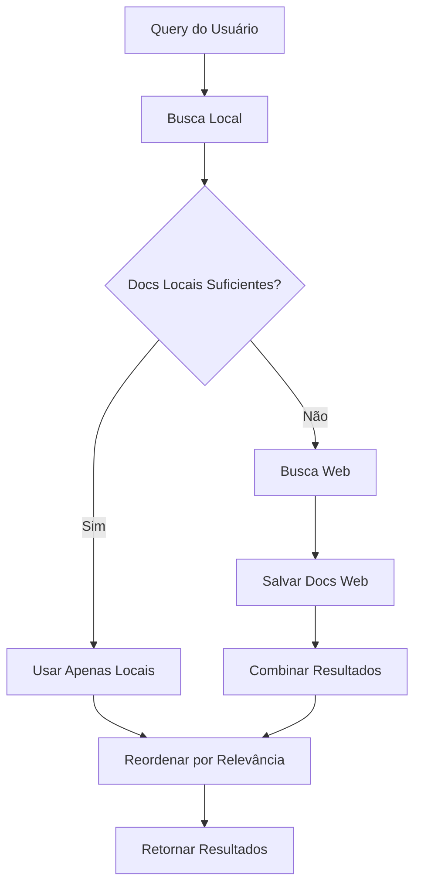

# Sistema de Busca Híbrida do DesmentAI

## Visão Geral

O DesmentAI agora implementa um sistema de busca híbrida que combina documentos locais indexados com busca em tempo real na web. Isso permite que o sistema tenha acesso tanto a informações já processadas e confiáveis quanto a dados atualizados da internet.

## Como Funciona

### 1. Busca Local Primeiro
- O sistema sempre começa buscando nos documentos já indexados localmente
- Usa embeddings semânticos para encontrar documentos mais relevantes
- Aplica threshold de similaridade para filtrar resultados de baixa qualidade

### 2. Decisão de Busca Web
O sistema decide buscar na web quando:
- **Poucos documentos locais**: Menos de 2 documentos encontrados
- **Baixa relevância**: Score médio de similaridade abaixo de 0.6
- **Contexto insuficiente**: Documentos locais não cobrem adequadamente a consulta

### 3. Busca na Web (Tavily)
- Usa a API do Tavily para buscar informações atualizadas
- Limita a 3 resultados para evitar sobrecarga
- Foca em fontes confiáveis e verificadas

### 4. Salvamento Automático
- Documentos encontrados na web são automaticamente salvos
- Processados e indexados no vector store local
- Disponíveis para consultas futuras sem nova busca web

### 5. Combinação e Reordenação
- Combina resultados locais e web
- Reordena por relevância (score de similaridade)
- Atualiza ranks dos documentos

## Configurações

### Parâmetros do RetrieverAgent

```python
RetrieverAgent(
    llm=llm,
    vector_store=vector_store,
    document_processor=document_processor,
    embedding_manager=embedding_manager,
    min_local_docs=2,              # Mínimo de docs locais para não buscar web
    web_search_threshold=0.6       # Threshold de relevância para buscar web
)
```

### Estratégias de Busca

1. **Local Only**: Documentos locais suficientes e relevantes
2. **Hybrid**: Combina local + web
3. **Web Only**: Apenas web (quando local falha)

## Vantagens

### ✅ Eficiência
- Busca local é mais rápida
- Evita chamadas desnecessárias à API web
- Reutiliza informações já processadas

### ✅ Atualização
- Acesso a informações mais recentes
- Complementa base local com dados atuais
- Mantém sistema atualizado automaticamente

### ✅ Confiabilidade
- Prioriza fontes locais verificadas
- Web como backup para informações faltantes
- Controle de qualidade com thresholds

### ✅ Escalabilidade
- Documentos web são salvos para futuras consultas
- Base de conhecimento cresce automaticamente
- Reduz dependência de APIs externas

## Fluxo de Execução



## Monitoramento

O sistema fornece informações detalhadas sobre cada busca:

```python
{
    "search_source": "hybrid",      # local_only, hybrid, web_only
    "local_docs": 2,                # Documentos encontrados localmente
    "web_docs": 3,                  # Documentos encontrados na web
    "num_documents": 5,             # Total de documentos
    "search_successful": True       # Sucesso da busca
}
```

## Exemplo de Uso

```python
# Inicializar DesmentAI
desmentai = DesmentAI()

# Verificar notícia (busca híbrida automática)
result = desmentai.verify_news("Últimas notícias sobre IA")

# Verificar fonte da busca
source = result['agent_results']['retriever']['search_source']
local_docs = result['agent_results']['retriever']['local_docs']
web_docs = result['agent_results']['retriever']['web_docs']

print(f"Fonte: {source}")
print(f"Documentos locais: {local_docs}")
print(f"Documentos web: {web_docs}")
```

## Teste do Sistema

Execute o script de teste para verificar a funcionalidade:

```bash
python test_hybrid_search.py
```

Este script testa:
- Consultas que devem usar apenas documentos locais
- Consultas que precisam de busca web
- Verificação de salvamento automático
- Monitoramento de performance

## Considerações Técnicas

### Performance
- Busca local: ~100ms
- Busca web: ~2-5s (depende da API)
- Salvamento: ~500ms

### Limitações
- Dependência da API Tavily
- Custo de chamadas web
- Latência adicional para buscas web

### Otimizações Futuras
- Cache inteligente de consultas web
- Pré-processamento de consultas populares
- Análise de padrões de busca
- Otimização de thresholds dinâmicos
